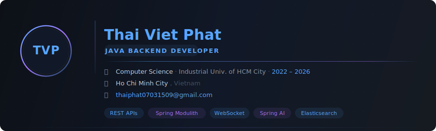

<p align="center">
  
</p>

<h1 align="center">Hi there! 👋 I'm Thai Viet Phat</h1>

<p align="center">
  
</p>

<p align="center">
  <a href="https://github.com/ThaiVietPhat">
    
  </a>
  <a href="https://github.com/ThaiVietPhat?tab=followers">
    
  </a>
  
  
</p>

---

<h2 align="center">⚡ About Me</h2>

<p align="center">
  
</p>

<p align="center">
  <strong>Transforming complex problems into elegant, scalable backend solutions.</strong>
</p>

I am a passionate **Java Backend Developer** based in Ho Chi Minh City, Vietnam. With a strong foundation in Computer Science and a deep interest in distributed systems, I specialize in architecting high-performance APIs, real-time communication networks, and cloud-native microservices. I thrive in environments that challenge me to build robust, secure, and production-ready applications.

<details>
<summary><b>👨‍💻 View Developer Profile (Java)</b></summary>
<br>

```java
public record Profile(
    String name,
    String role,
    String education,
    String location,
    String[] coreCompetencies
) {
    public static final Profile ME = new Profile(
        "Thai Viet Phat",
        "Java Backend Developer (Intern / Fresher)",
        "Industrial University of Ho Chi Minh City — CS (2022 - Present)",
        "Ho Chi Minh City, Vietnam",
        new String[] {
            "RESTful APIs & Microservices Architecture",
            "Real-time Systems (WebSocket, Kafka)",
            "Stateless Security (JWT, OAuth2)",
            "AI Integration (Spring AI, LLMs)",
            "Cloud Deployments (Docker, Kubernetes, AWS)"
        }
    );

    public static void main(String[] args) {
        System.out.println("Turning ☕ coffee into production-ready Java APIs.");
    }
}
```

</details>

---

<h2 align="center">🔭 Currently Building & Learning</h2>

<table>
  <tr>
    <td width="50%" valign="top">
      <h3>🛠️ Current Focus</h3>
      <ul>
        <li>Mastering <b>Spring Boot 3.x</b> and <b>Java 21</b> features.</li>
        <li>Exploring <b>Microservices</b> patterns and Event-Driven Architectures with <b>Apache Kafka</b>.</li>
        <li>Deepening knowledge of <b>Cloud-Native</b> deployments using <b>Docker & Kubernetes</b>.</li>
      </ul>
    </td>
    <td width="50%" valign="top">
      <h3>🚀 What's Next</h3>
      <ul>
        <li>Diving deeper into <b>System Design</b> and massive scale architectures.</li>
        <li>Contributing to prominent Open Source software.</li>
        <li>Exploring advanced <b>Spring AI</b> use cases for modern smart applications.</li>
      </ul>
    </td>
  </tr>
</table>

---

<h2 align="center">💻 Tech Stack</h2>

<div align="center">

**Languages & Core Frameworks**<br>


<br><br>

**Databases & Messaging**<br>


<br><br>

**DevOps, Cloud & Tools**<br>


</div>

---

<h2 align="center">🏆 Highlights & Achievements</h2>

- 🌟 Developed a **Real-Time Chat Application (Zalo Clone)** capable of handling instant messaging and media sharing with minimal latency.
- 🔒 Implemented advanced **stateless security paradigms** using embedded token versioning in JWTs.
- 🤖 Successfully integrated **Generative AI capabilities** into traditional Java backend applications using Spring AI.
- 📈 Maintained a consistent track record of continuous learning and contribution, as reflected in my daily GitHub activity and streak.

---

<h2 align="center">🚀 Featured Projects</h2>

<!-- START_FEATURED_PROJECTS -->

### 💡 Shopee Clone Microservices

> **Status:** Active | **Stars:** ⭐ 1
>
> E-commerce microservices platform inspired by Shopee — Spring Boot 3, Kafka, Redis, Docker

<table>
<tr>
<th width="100%">🛠️ Technical Highlights</th>
</tr>
<tr>
<td valign="top">

- **Spring Boot:** Robust backend application using Spring Boot.
- **Microservices:** Scalable distributed microservices architecture.
- **Apache Kafka:** Event-driven architecture and real-time messaging.
- **Redis:** High-performance caching and distributed sessions.
- **Docker:** Containerized deployment and environment consistency.

</td>
</tr>
</table>

<p>
  <a href="https://github.com/ThaiVietPhat/shopee-clone-microservices">
    
  </a>
  
  
  
</p>

---

### 💡 Pbank Microservice

> **Status:** Active | **Stars:** ⭐ 1
>
> A high-performance banking microservices architecture built with Java/Kotlin, Spring Boot, and Cloud-native patterns.

<table>
<tr>
<th width="100%">🛠️ Technical Highlights</th>
</tr>
<tr>
<td valign="top">

- **Java:** Backend development using Java.
- **Spring Boot:** Robust backend application using Spring Boot.
- **Microservices:** Scalable distributed microservices architecture.

</td>
</tr>
</table>

<p>
  <a href="https://github.com/ThaiVietPhat/pbank-microservice">
    
  </a>
  
  
  
</p>

---

### 💡 Zalo Fullstack App

> **Status:** Active | **Stars:** ⭐ 1
>
> Full-stack chat platform with real-time messaging, AI assistant, session management, and admin RBAC | Spring Boot + React

<table>
<tr>
<th width="100%">🛠️ Technical Highlights</th>
</tr>
<tr>
<td valign="top">

- **Spring Boot:** Robust backend application using Spring Boot.

</td>
</tr>
</table>

<p>
  <a href="https://github.com/ThaiVietPhat/zalo-fullstack-app">
    
  </a>
  
</p>

---


<!-- END_FEATURED_PROJECTS -->

---

<h2 align="center">📊 GitHub Statistics</h2>

<div align="center">

<table align="center">
  <tr>
    <td align="center">
      <picture>
        <source media="(prefers-color-scheme: dark)" srcset="https://github-readme-stats.vercel.app/api?username=ThaiVietPhat&show_icons=true&theme=github_dark&hide_border=true&include_all_commits=true&count_private=true&rank_icon=github&bg_color=0d1117&title_color=58a6ff&icon_color=a371f7&text_color=c9d1d9" />
        
      </picture>
    </td>
    <td align="center">
      <picture>
        <source media="(prefers-color-scheme: dark)" srcset="https://github-readme-stats.vercel.app/api/top-langs/?username=ThaiVietPhat&layout=compact&theme=github_dark&hide_border=true&langs_count=8&bg_color=0d1117&title_color=58a6ff&text_color=c9d1d9" />
        
      </picture>
    </td>
  </tr>
</table>

<picture>
  <source media="(prefers-color-scheme: dark)" srcset="https://github-readme-streak-stats.herokuapp.com/?user=ThaiVietPhat&theme=github-dark-blue&hide_border=true&date_format=j%20M%5B%20Y%5D&background=0D1117&ring=58a6ff&fire=a371f7&currStreakLabel=58a6ff&currStreakNum=a371f7&sideNums=58a6ff&sideLabels=8b949e&dates=8b949e" />
  
</picture>

<br><br>

<picture>
  <source media="(prefers-color-scheme: dark)" srcset="https://github-readme-activity-graph.vercel.app/graph?username=ThaiVietPhat&bg_color=0d1117&color=58a6ff&line=a371f7&point=58a6ff&area=true&area_color=a371f720&hide_border=true&custom_title=Contribution%20Activity" />
  
</picture>

<br><br>


<br><br>

<picture>
  <source media="(prefers-color-scheme: dark)" srcset="https://raw.githubusercontent.com/ThaiVietPhat/ThaiVietPhat/output/github-contribution-grid-snake-dark.svg" />
  
</picture>

<br>
<sub>Auto-regenerated daily via GitHub Actions 🐍</sub>

</div>

---

<h2 align="center">🎓 Experience & Education</h2>

<div align="center">

**Industrial University of Ho Chi Minh City (IUH)**
<br>
*Bachelor of Science in Computer Science* (2022 – Present)
<br>
Focusing on software engineering principles, algorithm optimization, and modern distributed systems architecture.

</div>

---

<h2 align="center">📫 Let's Connect</h2>

<p align="center">
  Feel free to reach out if you want to collaborate, discuss tech, or just say hi!
</p>

<p align="center">
  <a href="mailto:thaiphat07031509@gmail.com">
    
  </a>
  <a href="https://linkedin.com/in/thai-viet-phat">
    
  </a>
  <a href="https://github.com/ThaiVietPhat">
    
  </a>
</p>

<p align="center">
  <sub><i>Currently seeking opportunities for Java Backend Intern / Fresher roles in Ho Chi Minh City.</i></sub>
</p>

<p align="center">
  
</p>
