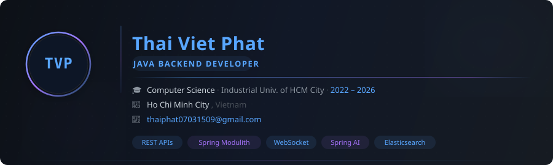

<p align="center">
  
</p>

<h1 align="center">Hi there! 👋 I'm Thai Viet Phat</h1>

<p align="center">
  
</p>

<p align="center">
  <a href="https://github.com/ThaiVietPhat">
    
  </a>
  <a href="https://github.com/ThaiVietPhat?tab=followers">
    
  </a>
  
  
</p>

---

<h2 align="center">⚡ About Me</h2>

<p align="center">
  
</p>

<p align="center">
  <strong>Building production-minded Java backends — from real-time chat to e-commerce at scale.</strong>
</p>

I am a **Java Backend Developer** based in Ho Chi Minh City, Vietnam, currently interning at **FPT Software**. Final-year Computer Science student at IUH (expected graduation 2026) with hands-on experience building full-stack applications with real-time messaging, payment integration, semantic search, and AI features. I focus on writing defensible, testable, production-ready code.

<details>
<summary><b>👨‍💻 View Developer Profile (Java)</b></summary>
<br>

```java
public record Profile(
    String name,
    String role,
    String education,
    String location,
    String[] coreCompetencies
) {
    public static final Profile ME = new Profile(
        "Thai Viet Phat",
        "Java Backend Developer — Intern @ FPT Software",
        "Industrial University of Ho Chi Minh City — CS (2022 - 2026)",
        "Ho Chi Minh City, Vietnam",
        new String[] {
            "RESTful APIs & Modular Monolith Architecture (Spring Modulith)",
            "Real-Time Systems (WebSocket STOMP, event-driven side effects)",
            "Stateless Security (JWT rotation, refresh token family, OAuth2)",
            "AI Integration (Spring AI, pgvector semantic search, Groq/Gemini)",
            "Payment Integration (VNPay sandbox, idempotent webhook handling)",
            "Cloud Storage (Cloudflare R2), Observability (Actuator, Prometheus)"
        }
    );

    public static void main(String[] args) {
        System.out.println("Turning ☕ coffee into production-ready Java APIs.");
    }
}
```

</details>

---

<h2 align="center">🔭 Currently Building & Learning</h2>

<table>
  <tr>
    <td width="50%" valign="top">
      <h3>🛠️ Current Focus</h3>
      <ul>
        <li>Interning at <b>FPT Software</b> — applying Java backend skills in a real enterprise environment.</li>
        <li>Completing graduation thesis: <b>Shopee Clone</b> — a production-minded modular monolith with full buyer/seller/admin flow.</li>
        <li>Deepening PostgreSQL internals, JPA/Hibernate, and Spring Boot testing.</li>
      </ul>
    </td>
    <td width="50%" valign="top">
      <h3>🚀 What's Next</h3>
      <ul>
        <li>Complete Shopee Clone frontend and publish live demo.</li>
        <li>DSA practice via <b>NeetCode 150</b> (1–2 problems/day, Java).</li>
        <li>Targeting full-time Java Backend roles at fintech/product companies in late 2026.</li>
      </ul>
    </td>
  </tr>
</table>

---

<h2 align="center">💻 Tech Stack</h2>

<div align="center">

**Languages & Core Frameworks**<br>


<br><br>

**Databases, Search & Messaging**<br>


<br><br>

**DevOps, Cloud & Tools**<br>


</div>

---

<h2 align="center">🏆 Technical Highlights</h2>

**Zalo Clone**
- 🔄 **Refresh token rotation with family tracking** — reuse detection invalidates the entire family and force-logouts all sessions
- 🔒 **JWT with embedded `tokenVersion`** — server-side invalidation per-user without a token blocklist
- 🤖 **Spring AI + Groq (LLaMA 3.1)** — AI chatbot, per-conversation smart reply suggestions, and date-range message summarization
- 📡 **WebRTC call signaling via STOMP relay** — offer/answer/ICE candidate exchange with call history persistence

**Shopee Clone** *(Graduation Thesis — IUH 2026)*
- 💳 **VNPay sandbox integration** — signed webhook verification, idempotent duplicate-webhook handling, payment timeout scheduler
- 🛡️ **Optimistic locking + explicit lock ordering** for inventory reservations — prevents double-spend and deadlock at checkout
- 🔍 **Elasticsearch keyword/facet search + pgvector semantic search** — automatic graceful fallback to PostgreSQL LIKE when ES is degraded
- 📦 **Spring Modulith event publication registry** — reliable cross-module side effects (indexing, notification, email) with zero tight coupling
- 📊 **Prometheus/Micrometer observability** — custom counters for scheduler throughput, AI fallback rate, search degradation, and webhook duplicates

---

<h2 align="center">🚀 Featured Projects</h2>

<!-- START_FEATURED_PROJECTS -->
<!-- END_FEATURED_PROJECTS -->

<h2 align="center">📊 GitHub Statistics</h2>

<div align="center">

<table align="center">
  <tr>
    <td align="center">
      <picture>
        <source media="(prefers-color-scheme: dark)" srcset="https://github-readme-stats.vercel.app/api?username=ThaiVietPhat&show_icons=true&theme=github_dark&hide_border=true&include_all_commits=true&count_private=true&rank_icon=github&bg_color=0d1117&title_color=58a6ff&icon_color=a371f7&text_color=c9d1d9" />
        
      </picture>
    </td>
    <td align="center">
      <picture>
        <source media="(prefers-color-scheme: dark)" srcset="https://github-readme-stats.vercel.app/api/top-langs/?username=ThaiVietPhat&layout=compact&theme=github_dark&hide_border=true&langs_count=8&bg_color=0d1117&title_color=58a6ff&text_color=c9d1d9" />
        
      </picture>
    </td>
  </tr>
</table>

<picture>
  <source media="(prefers-color-scheme: dark)" srcset="https://github-readme-streak-stats.herokuapp.com/?user=ThaiVietPhat&theme=github-dark-blue&hide_border=true&date_format=j%20M%5B%20Y%5D&background=0D1117&ring=58a6ff&fire=a371f7&currStreakLabel=58a6ff&currStreakNum=a371f7&sideNums=58a6ff&sideLabels=8b949e&dates=8b949e" />
  
</picture>

<br><br>

<picture>
  <source media="(prefers-color-scheme: dark)" srcset="https://github-readme-activity-graph.vercel.app/graph?username=ThaiVietPhat&bg_color=0d1117&color=58a6ff&line=a371f7&point=58a6ff&area=true&area_color=a371f720&hide_border=true&custom_title=Contribution%20Activity" />
  
</picture>

<br><br>


<br><br>

<picture>
  <source media="(prefers-color-scheme: dark)" srcset="https://raw.githubusercontent.com/ThaiVietPhat/ThaiVietPhat/output/github-contribution-grid-snake-dark.svg" />
  
</picture>

<br>
<sub>Auto-regenerated daily via GitHub Actions 🐍</sub>

</div>

---

<h2 align="center">🎓 Experience & Education</h2>

<div align="center">

**FPT Software** — Java Backend Intern *(June 2026 – Present)*

<br>

**Industrial University of Ho Chi Minh City (IUH)**
<br>
*Bachelor of Science in Computer Science* (2022 – 2026)
<br>
Specializing in software engineering, distributed systems, and algorithm design.

</div>

---

<h2 align="center">📫 Let's Connect</h2>

<p align="center">
  Feel free to reach out if you want to collaborate, discuss tech, or just say hi!
</p>

<p align="center">
  <a href="mailto:thaiphat07031509@gmail.com">
    
  </a>
  <a href="https://linkedin.com/in/thai-viet-phat">
    
  </a>
  <a href="https://github.com/ThaiVietPhat">
    
  </a>
</p>

<p align="center">
  <sub><i>Java Backend Developer · Interning at FPT Software · Available for full-time roles from late 2026 (Ho Chi Minh City)</i></sub>
</p>

<p align="center">
  
</p>
